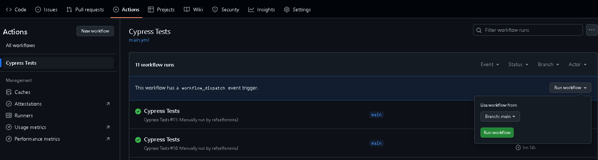

## Sobre

Repositório de teste técnico Dot Digital Group

Todas as histórias de usuários estão [AQUI](./user_story).

## Estimativas
- Teste exploratório (1h)
  - Sem nunca ter contato com o site em questão, realizei um teste exploratório prévio para me familiarizar com os fluxos e levantamento de cenários
- Levantamento de cenários (1h)
- Setup inicial do projeto (estrutura base, pipeline de execução de testes, integrações via API) (2h)
- Automação de testes (11h)
  - Média de 0,5h por cenário de testes 
  - Criação de massas de testes
  - Implementação de scripts
  - Execução e validação
  - Documentação

## Stacks utilizadas
- Javascript
- Cypress (14.2.0)
- NodeJs (v22.14.0)

## Execução via Github Actions

1. Realizar o fork do repositório
2. Acessar o workflow de execução em desafio-dot/actions/workflows/main.yml
3. Clicar no botão 'Run workflow' e confirmar a execução com a branch main
4. Será apresentado na listagem abaixo o workflow em execução
5. Ao finalizar em caso de sucesso, apresentará o workflow com ícone verde
6. Acessar e selecionar qual a o navegador executado deseja visualizar o resultado dos testes
7. Selecionar o step 'Run E2E tests' para visualizar o relatório
   


## Execução local

1. Clonar o repositório, instalar as dependências via terminal na raiz do projeto
```
yarn install / npm install
```

2. Para acompanhar a execução dos testes via interface gráfica, execute o comando abaixo e selecione a suite desejada
```
yarn cypress open / npx cypress open 
```

3. Executar todos os testes em Headless
```
yarn cypress run / npx cypress run 
```
